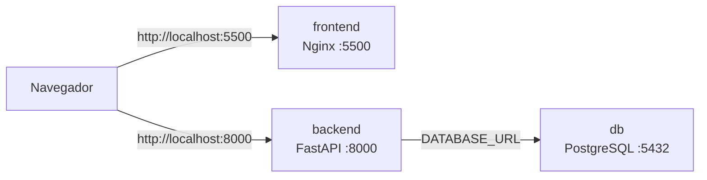

# AtendeMax

Sistema web de **fila de atendimento** com prioridade para clientes preferenciais, persistência em PostgreSQL e orquestração completa via Docker Compose.

O projeto está organizado em **monorepo**: frontend, backend e infraestrutura Docker convivem no mesmo repositório, iniciados com um único comando.

---

## Funcionalidades

- Cadastro de clientes (tipo **normal** ou **preferencial**)
- Fila ordenada automaticamente: preferenciais primeiro; dentro de cada grupo, por ordem de chegada
- Chamada do próximo cliente da fila
- Cancelamento de clientes aguardando
- Conclusão de atendimentos em andamento
- Histórico com filtros por tipo e status
- Persistência de dados no PostgreSQL (sobrevive a reinícios dos containers)

---

## Arquitetura



| Camada    | Tecnologia              | Container            | Porta (host) |
|-----------|-------------------------|----------------------|--------------|
| Frontend  | HTML, CSS, JavaScript   | `atendemax-frontend` | 5500         |
| Backend   | Python 3.12 + FastAPI   | `atendemax-backend`  | 8000         |
| Banco     | PostgreSQL 16 Alpine    | `atendemax-db`       | 5432         |

Os três containers compartilham a rede Docker `atendemax-network`. O backend conecta ao banco pelo hostname interno `db`; o navegador acessa frontend e API pelas portas expostas no `localhost`.

---

## Pré-requisitos

- [Docker](https://docs.docker.com/get-docker/) 20.10+
- [Docker Compose](https://docs.docker.com/compose/) v2+

Verifique a instalação:

```bash
docker --version
docker compose version
```

---

## Início rápido

Clone o repositório e, na **raiz do projeto**, execute:

```bash
docker compose up --build
```

Aguarde os três containers subirem. O backend só inicia após o PostgreSQL passar no healthcheck.

### Acessos

| Recurso              | URL                          |
|----------------------|------------------------------|
| Interface web        | http://localhost:5500        |
| Documentação da API  | http://localhost:8000/docs   |
| Health check da API  | http://localhost:8000/       |

Para rodar em segundo plano:

```bash
docker compose up --build -d
```

---

## Estrutura do projeto

```
atendemax-docker/
├── docker-compose.yml       # Orquestração dos 3 serviços
├── backend/
│   ├── Dockerfile
│   ├── main.py              # Aplicação FastAPI e rotas
│   ├── requirements.txt
│   ├── database/
│   │   ├── database.py      # Conexão SQLAlchemy
│   │   └── models.py        # Modelo Cliente (PostgreSQL)
│   ├── models/
│   │   └── cliente.py       # Schemas Pydantic
│   └── services/
│       └── fila_service.py  # Regras de negócio da fila
├── frontend/
│   ├── Dockerfile
│   ├── nginx.conf
│   ├── index.html
│   ├── css/
│   └── js/
│       ├── api/atendimentoApi.js
│       ├── components/
│       └── pages/
└── docs/
    ├── DOCUMENTACAO.md
    └── DOCUMENTACAO.pdf       # Documentação técnica para entrega
```

---

## Containers e configuração

### Banco de dados (`db`)

- Imagem: `postgres:16-alpine`
- Credenciais: `atendemax` / `atendemax123`
- Banco: `atendemax`
- Volume: `postgres_data` (dados persistidos entre reinícios)
- **Não possui Dockerfile** — usa imagem oficial diretamente

### Backend (`backend`)

- Build: `backend/Dockerfile` (base `python:3.12-slim`)
- Servidor: uvicorn na porta 8000
- Variável de ambiente:

  ```
  DATABASE_URL=postgresql://atendemax:atendemax123@db:5432/atendemax
  ```

- CORS liberado para `http://localhost:5500` e `http://127.0.0.1:5500`

### Frontend (`frontend`)

- Build: `frontend/Dockerfile` (base `nginx:alpine`)
- Serve arquivos estáticos na porta 80 do container (mapeada para **5500** no host)
- A API é chamada pelo navegador em `http://localhost:8000` (`js/api/atendimentoApi.js`)

---

## API — endpoints principais

| Método   | Rota                              | Descrição                    |
|----------|-----------------------------------|------------------------------|
| `GET`    | `/`                               | Health check                 |
| `GET`    | `/fila`                           | Listar fila de atendimento   |
| `POST`   | `/clientes`                       | Cadastrar novo cliente       |
| `POST`   | `/fila/chamar`                    | Chamar próximo da fila       |
| `DELETE` | `/clientes/{id}`                  | Cancelar cliente aguardando  |
| `POST`   | `/atendimentos/{id}/concluir`     | Concluir atendimento         |
| `GET`    | `/historico`                      | Listar histórico (com filtros)|

Documentação interativa (Swagger): http://localhost:8000/docs

### Exemplo — cadastrar cliente

```bash
curl -X POST http://localhost:8000/clientes \
  -H "Content-Type: application/json" \
  -d '{"nome": "Maria Silva", "tipo": "preferencial"}'
```

### Exemplo — consultar fila

```bash
curl http://localhost:8000/fila
```

---

## Comandos Docker

Todos executados na raiz do projeto:

```bash
# Validar sintaxe do compose
docker compose config

# Construir e iniciar
docker compose up --build

# Iniciar em segundo plano
docker compose up --build -d

# Ver containers em execução
docker ps

# Acompanhar logs
docker compose logs -f
docker compose logs -f backend

# Parar containers (dados do banco são mantidos)
docker compose down

# Parar e apagar volume do banco
docker compose down -v

# Reconstruir apenas um serviço
docker compose up --build backend
```

---

## Validação do ambiente

Checklist para confirmar que tudo funciona:

1. `docker compose up --build` sobe **db**, **backend** e **frontend** sem erros
2. http://localhost:5500 exibe a interface
3. http://localhost:8000/docs exibe o Swagger
4. Cadastrar um cliente pela interface e verificar se aparece na fila
5. `docker compose down` seguido de `docker compose up` — clientes devem continuar cadastrados
6. No DevTools do navegador, não deve haver erros de **CORS**

---

## Solução de problemas

### Porta já em uso (`5432`, `8000` ou `5500`)

Outro processo ou container antigo pode estar ocupando a porta. Verifique:

```bash
docker ps
```

Pare containers conflitantes de execuções anteriores (repositórios separados, por exemplo) antes de subir o ambiente unificado:

```bash
docker compose down
docker stop <nome-do-container-conflitante>
```

### Backend não conecta ao banco

O backend aguarda o healthcheck do PostgreSQL. Se o banco demorar a iniciar, o compose tenta novamente automaticamente. Confira os logs:

```bash
docker compose logs db
docker compose logs backend
```

### Dados sumiram após reiniciar

Se você executou `docker compose down -v`, o volume `postgres_data` foi removido e os dados foram apagados. Use apenas `docker compose down` para preservar os dados.

---

## Desenvolvimento local (sem Docker)

O ambiente recomendado para demonstração é via Docker Compose. Para desenvolvimento isolado de cada camada:

**Backend** — requer PostgreSQL acessível e variável `DATABASE_URL` configurada:

```bash
cd backend
pip install -r requirements.txt
uvicorn main:app --reload --host 0.0.0.0 --port 8000
```

**Frontend** — abra `frontend/index.html` com um servidor estático local (ex.: Live Server na porta 5500) apontando a API para `http://localhost:8000`.

---

## Documentação

A documentação técnica completa para entrega do projeto está em:

- **PDF:** [`/DOCUMENTACAO.pdf`](DOCUMENTACAO.pdf)

Inclui descrição da aplicação, mapeamento de containers, comandos e detalhes de configuração do `docker-compose.yml`.

---

## Licença

Projeto acadêmico — AtendeMax.
